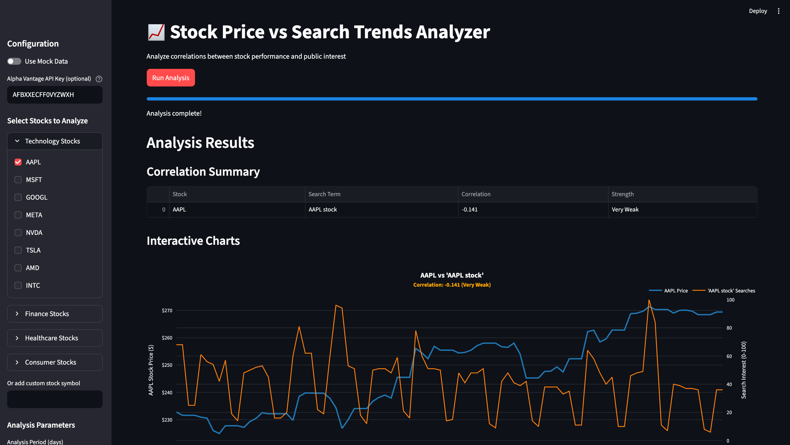
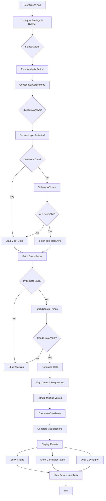

# 📈 Stock Price vs Search Trends Analyzer

An interactive web application that analyzes correlations between stock market performance and public search interest using real-time data from Alpha Vantage and Google Trends APIs.

---

## 📋 Table of Contents

- [Overview](#overview)
- [What It Does](#what-it-does)
- [How It Works](#how-it-works)
- [Architecture](#architecture)
- [System Flow Diagram](#system-flow-diagram)
- [Prerequisites](#prerequisites)
- [Installation](#installation)
- [Running the Application](#running-the-application)
- [Usage](#usage)
- [Configuration](#configuration)
- [Project Structure](#project-structure)
- [Features](#features)
- [Technologies](#technologies)
- [Contributing](#contributing)
- [Code of Conduct](#code-of-conduct)
- [Troubleshooting](#troubleshooting)

---

## 📌 Overview

The **Stock Price vs Search Trends Analyzer** is designed to help students, analysts, and hobbyists understand potential relationships between stock price movements and public interest in those stocks or related topics. By comparing historical stock prices with Google search trends, users can explore whether increased public interest correlates with stock performance.

**Key Insight**: When people search for a stock or topic more frequently, does the stock price tend to rise or fall? This application helps answer that question.

---

## 📸 Screenshots

### Application Interface


*The main interface showing stock selection, configuration, and analysis results with interactive charts*

---

## 🎯 What It Does

### Core Functionality

1. **Stock Price Data Fetching**
   - Retrieves daily closing prices for selected stock symbols
   - Uses Alpha Vantage API as primary source
   - Falls back to mock data if API is unavailable

2. **Search Trends Analysis**
   - Fetches search interest data from Google Trends
   - Normalizes data on a 0-100 scale
   - Aligns trends with the selected time period

3. **Correlation Calculation**
   - Computes Pearson correlation coefficient between stock prices and search trends
   - Interprets correlation strength (Strong, Moderate, Weak, Very Weak)
   - Handles data alignment and missing values

4. **Interactive Visualization**
   - Dual-axis charts showing price and search interest trends
   - Color-coded correlation strength indicators
   - Responsive design for multiple stocks

5. **Data Export**
   - Download analysis results as CSV files
   - Includes raw data for further analysis

---

## 🔧 How It Works

### Step-by-Step Process

1. **User Input Collection**
   - Select stock symbols from predefined categories (Technology, Finance, Healthcare, Consumer)
   - Or enter custom stock symbols
   - Specify analysis period (30-365 days)
   - Choose keywords (auto-generated or custom)

2. **Data Fetching**
   - Fetch stock price data from Alpha Vantage
   - Fetch search trend data from Google Trends (via PyTrends)
   - Handle API rate limits and timeouts gracefully

3. **Data Normalization**
   - Convert timestamps to unified timezone-naive format
   - Resample data to daily frequency
   - Forward-fill missing values

4. **Data Fusion**
   - Align stock prices and search trends by date
   - Drop rows with missing data
   - Create unified DataFrame with both metrics

5. **Correlation Analysis**
   - Calculate Pearson correlation coefficient
   - Classify correlation strength (0-0.2: Very Weak, 0.2-0.4: Weak, etc.)
   - Generate statistical summary

6. **Visualization & Export**
   - Create dual-axis Plotly charts
   - Display correlation summary table
   - Provide CSV download option

---

## 🏗️ Architecture

### Design Pattern: Ports & Adapters (Clean Architecture)

The application follows Clean Architecture principles for modularity and testability:

```
┌─────────────────────────────────────────────────────────────┐
│                      Streamlit UI Layer                      │
│                    (streamlit_app.py)                        │
└────────────────────────┬────────────────────────────────────┘
                         │
                         ▼
┌─────────────────────────────────────────────────────────────┐
│                    Service Layer                             │
│              (AnalyzerServiceImpl)                            │
│  • Orchestrates data fetching                               │
│  • Performs correlation calculations                         │
└────────────────────────┬────────────────────────────────────┘
                         │
         ┌───────────────┴───────────────┐
         │                               │
         ▼                               ▼
┌─────────────────────┐        ┌─────────────────────┐
│   Ports (Interfaces)│        │   Ports (Interfaces)│
│  StockDataSource    │        │ TrendsDataSource    │
└──────────┬──────────┘        └──────────┬──────────┘
           │                              │
    ┌──────┴──────┐                ┌──────┴──────┐
    │             │                │             │
    ▼             ▼                ▼             ▼
┌─────────┐ ┌─────────┐      ┌─────────┐ ┌─────────┐
│ Alpha   │ │ Mock    │      │PyTrends │ │ Mock    │
│Vantage  │ │ Stock   │      │ Client  │ │ Trends  │
│ Client  │ │ Source  │      │         │ │ Source  │
└─────────┘ └─────────┘      └─────────┘ └─────────┘
```

### Key Components

- **`streamlit_app.py`**: Main UI and entry point
- **`app/services/analyzer_service_impl.py`**: Core business logic
- **`app/infrastructure/`**: API clients and data sources
- **`app/ports/`**: Interface definitions
- **`app/config/di.py`**: Dependency injection factory
- **`app/ui/charts.py`**: Visualization utilities

---

## 🔄 System Flow Diagram



---

## 📋 Prerequisites

Before running the application, ensure you have:

### System Requirements

- **Python 3.12+** (or 3.11+)
- **macOS, Linux, or Windows**
- **Internet connection** (for API calls)

### Required Accounts & API Keys

1. **Alpha Vantage API Key** (for real stock data)
   - Free tier available
   - Sign up at: https://www.alphavantage.co/support/#api-key
   - **Rate limit**: 5 calls/minute (free tier)

2. **Google Trends Access** (automatic via PyTrends)
   - No API key required
   - Subject to Google's rate limiting

### Optional: Mock Mode

- No API keys required
- Perfect for development and testing
- Set `USE_MOCK=true` in `.env`

---

## 🚀 Installation

### From Scratch

Follow these steps to get the application running from a fresh environment:

#### 1. **Clone or Download the Repository**

```bash
cd /path/to/Stock-Trend-APP
```

#### 2. **Create a Python Virtual Environment**

```bash
# Create virtual environment
python3 -m venv .venv

# Activate virtual environment
# On macOS/Linux:
source .venv/bin/activate

# On Windows:
.venv\Scripts\activate
```

#### 3. **Install Dependencies**

```bash
# Upgrade pip
pip install --upgrade pip

# Install required packages
pip install -r requirements.txt
```

#### 4. **Set Up Environment Configuration**

Create or update the `.env` file in the project root:

```bash
# Copy the template if it exists
cp .env.example .env 2>/dev/null || echo "# Environment configuration" > .env
```

Edit `.env` with your configuration:

```properties
# Use mock data (true) or real APIs (false)
USE_MOCK=false

# Alpha Vantage API Key (get from https://www.alphavantage.co/support/#api-key)
ALPHAVANTAGE_API_KEY=your_api_key_here
```

**For Demo Mode** (using mock data):

```properties
USE_MOCK=true
# API key is not needed in mock mode
```

#### 5. **Verify Installation**

```bash
# Test Python and dependencies
python -c "import streamlit; import pandas; import plotly; print('✅ All dependencies installed')"
```

---

## ▶️ Running the Application

### Quick Start

```bash
# Make sure you're in the project root directory
cd /path/to/Stock-Trend-APP

# Activate virtual environment (if not already active)
source .venv/bin/activate  # macOS/Linux
# or
.venv\Scripts\activate     # Windows

# Run the Streamlit app
streamlit run streamlit_app.py
```

### Expected Output

```
  You can now view your Streamlit app in your browser.

  Local URL: http://localhost:8501
  Network URL: http://192.168.x.x:8501

  For better performance, install the Watchdog module:
    pip install watchdog
```

The app will automatically open in your default browser at `http://localhost:8501`

### Running with Custom Options

```bash
# Run with specific port
streamlit run streamlit_app.py --server.port 8502

# Run with logging
streamlit run streamlit_app.py --logger.level=debug

# Run without auto-opening browser
streamlit run streamlit_app.py --client.showErrorDetails=true
```

---

## 📖 Usage

### Basic Workflow

1. **Open the Sidebar**
   - Click the menu icon (☰) in the top-left corner

2. **Toggle Mock Data** (Optional)
   - Use the toggle to switch between mock and real data
   - **Recommended for first-time use**: Enable mock data

3. **Select Stocks**
   - Expand category sections (Technology, Finance, etc.)
   - Check boxes for stocks you want to analyze
   - Or enter a custom stock symbol (e.g., TSLA, MSFT)

4. **Set Analysis Period**
   - Adjust the slider to select 30-365 days of historical data
   - Longer periods provide more statistical significance

5. **Choose Keyword Mode**
   - **Auto-generate**: Uses "{SYMBOL} stock" as search term
   - **Custom**: Specify custom search terms for each stock

6. **Run Analysis**
   - Click the "Run Analysis" button
   - Wait for data to be fetched and processed

7. **Review Results**
   - View correlation summary table
   - Examine interactive charts
   - Inspect raw data in expandable sections
   - Download results as CSV

### Example Scenarios

#### Scenario 1: Tech Stock Trends
- Select: AAPL, MSFT, GOOGL
- Period: 90 days
- Keywords: Auto-generate
- Use Mock Data: Yes (for testing)

#### Scenario 2: Compare Multiple Sectors
- Select stocks from Finance and Technology categories
- Period: 180 days
- Keywords: Custom (e.g., "Apple earnings", "Microsoft cloud")
- Use Mock Data: No (with valid API key)

---

## ⚙️ Configuration

### Environment Variables (.env)

| Variable | Default | Description |
|----------|---------|-------------|
| `USE_MOCK` | `true` | Use mock data (true) or real APIs (false) |
| `ALPHAVANTAGE_API_KEY` | *(empty)* | Your Alpha Vantage API key |

### UI Parameters (Sidebar)

| Parameter | Range | Default | Description |
|-----------|-------|---------|-------------|
| Mock Data Toggle | On/Off | Off | Enable/disable mock data |
| API Key Input | Text | From `.env` | Alpha Vantage API key |
| Stock Selection | Multiple | None | Stocks to analyze |
| Analysis Period | 30-365 | 90 | Days of historical data |
| Trends Keyword | Auto/Custom | Auto | Search term selection mode |

---

## 📁 Project Structure

```
Stock-Trend-APP/
├── README.md                           # This file
├── requirements.txt                    # Python dependencies
├── .env                                # Environment configuration
├── .gitignore                          # Git ignore rules
│
├── streamlit_app.py                    # Main Streamlit application
│
├── app/
│   ├── __init__.py
│   │
│   ├── config/
│   │   ├── __init__.py
│   │   └── di.py                       # Dependency injection factory
│   │
│   ├── domain/
│   │   └── __init__.py                 # Future domain models
│   │
│   ├── infrastructure/
│   │   ├── __init__.py
│   │   ├── alpha_vantage_client.py     # Stock data API client
│   │   ├── pytrends_client.py          # Google Trends client
│   │   └── mock_sources.py             # Mock data generators
│   │
│   ├── ports/
│   │   ├── __init__.py
│   │   ├── analyzer_service.py         # AnalyzerService interface
│   │   ├── stock_data_source.py        # StockDataSource interface
│   │   └── trends_data_source.py       # TrendsDataSource interface
│   │
│   ├── services/
│   │   ├── __init__.py
│   │   └── analyzer_service_impl.py    # Core business logic
│   │
│   ├── ui/
│   │   ├── __init__.py
│   │   └── charts.py                   # Visualization utilities
│   │
│   └── __pycache__/
│
├── docs/
│   └── design.md                       # Architecture design document
│
└── .venv/                              # Python virtual environment (created locally)
```

---

## ✨ Features

### Current Features

- ✅ **Multi-Stock Analysis**: Analyze up to multiple stocks simultaneously
- ✅ **Real-Time Data**: Fetch live stock prices and search trends
- ✅ **Correlation Analysis**: Calculate Pearson correlation coefficients
- ✅ **Interactive Charts**: Dual-axis Plotly charts with hover details
- ✅ **Data Export**: Download results as CSV files
- ✅ **Mock Mode**: Demo without API keys
- ✅ **Category-Based Selection**: Predefined stock categories
- ✅ **Custom Keywords**: Define custom search terms per stock
- ✅ **Responsive Design**: Works on desktop and tablets
- ✅ **Error Handling**: Graceful fallbacks and user-friendly error messages

### Planned Features

- 🔄 **Caching**: Redis or SQLite for faster repeated queries
- 🔄 **Historical Analysis**: Track correlations over multiple periods
- 🔄 **Advanced Statistics**: P-values, confidence intervals, lag analysis
- 🔄 **FastAPI Backend**: REST API for programmatic access
- 🔄 **Machine Learning**: Predictive models based on trends
- 🔄 **Portfolio Analysis**: Multi-stock portfolio insights

---

## 🛠️ Technologies

### Core Technologies

| Technology | Version | Purpose |
|------------|---------|---------|
| **Python** | 3.12+ | Programming language |
| **Streamlit** | 1.36.0+ | Web UI framework |
| **Pandas** | 2.0.0+ | Data manipulation |
| **NumPy** | 1.25.0+ | Numerical computing |
| **Plotly** | 5.20.0+ | Interactive charts |
| **Requests** | 2.31.0+ | HTTP requests |

### Data Sources

| Source | Purpose | API |
|--------|---------|-----|
| **Alpha Vantage** | Stock prices | REST (requires API key) |
| **Google Trends** | Search interest | Via PyTrends (rate-limited) |
| **PyTrends** | Trends client | Python wrapper for Google Trends |

### Development Tools

- **python-dotenv**: Environment variable management
- **Git**: Version control
- **Virtual Environment**: Python dependency isolation

---

## 🐛 Troubleshooting

### Common Issues and Solutions

#### Issue: "ModuleNotFoundError: No module named 'streamlit'"

**Solution:**
```bash
# Reactivate virtual environment
source .venv/bin/activate

# Reinstall dependencies
pip install -r requirements.txt
```

#### Issue: "429 Too Many Requests" from Google Trends

**Solution:**
- This is a Google rate limit. Wait a few minutes before retrying
- Use mock data: Set `USE_MOCK=true` in `.env`
- Reduce analysis frequency or use longer time periods

#### Issue: "Alpha Vantage API Key Invalid"

**Solution:**
1. Get a free API key at: https://www.alphavantage.co/support/#api-key
2. Update `.env` file:
   ```
   ALPHAVANTAGE_API_KEY=your_correct_key_here
   ```
3. Restart the Streamlit app

#### Issue: "No overlapping data returned for stock"

**Solution:**
- The stock symbol may be invalid
- Try a different symbol (check stock exchanges)
- The API might be rate-limited; try mock data first
- Use a longer analysis period

#### Issue: "Connection refused" or Network errors

**Solution:**
- Check internet connection
- Verify firewall settings
- Try enabling mock mode temporarily
- Check API status pages (Alpha Vantage, Google)

#### Issue: App runs but shows blank page

**Solution:**
```bash
# Clear Streamlit cache
rm -rf ~/.streamlit/cache*

# Restart app
streamlit run streamlit_app.py --logger.level=debug
```

#### Issue: Virtual environment not activating

**Solution:**
```bash
# Try creating a new virtual environment
rm -rf .venv
python3 -m venv .venv
source .venv/bin/activate
pip install -r requirements.txt
```

---

## 📚 Additional Resources

- **Alpha Vantage API**: https://www.alphavantage.co/
- **PyTrends Documentation**: https://github.com/GeneralMills/pytrends
- **Streamlit Documentation**: https://docs.streamlit.io/
- **Plotly Charts**: https://plotly.com/python/
- **Pandas Guide**: https://pandas.pydata.org/docs/

---

## 📝 License

This project is licensed under the **MIT License** - see the [LICENSE](LICENSE) file for details.

This project is part of the Software Design course at Tampere University (3rd Semester).

---

## 👥 Contributing

For improvements and bug reports, please contact the development team.

---

## 🤝 Contributing

We welcome contributions from the community! Whether you're fixing bugs, adding features, improving documentation, or suggesting ideas, we'd love to have your help.

### Getting Started with Contributions

1. **Fork the Repository** - Click "Fork" on GitHub
2. **Clone Your Fork** - `git clone https://github.com/YOUR_USERNAME/stock-trend-analyze.git`
3. **Create a Branch** - `git checkout -b feature/your-feature-name`
4. **Make Changes** - Follow our [CONTRIBUTING.md](CONTRIBUTING.md) guidelines
5. **Submit a Pull Request** - We'll review and merge your contribution

### Types of Contributions We Accept

- 🐛 **Bug Reports & Fixes** - Help us squash bugs
- ✨ **New Features** - Suggest and implement new functionality
- 📝 **Documentation** - Improve guides, examples, and comments
- � **UI/UX Improvements** - Make the app more user-friendly
- 🧪 **Tests** - Increase code coverage and reliability
- 💡 **Ideas & Discussions** - Suggest improvements in Issues

### For More Details

👉 See [CONTRIBUTING.md](CONTRIBUTING.md) for:
- Detailed contribution process
- Code style guidelines
- Testing requirements
- PR submission checklist
- Development setup

### Contributors

We recognize and celebrate all contributions! See [CONTRIBUTORS.md](CONTRIBUTORS.md) for a list of amazing people who've helped this project.

---

## 📜 Code of Conduct

We are committed to maintaining a welcoming and inclusive community. All contributors and participants are expected to follow our [Code of Conduct](CODE_OF_CONDUCT.md).

**Key principles:**
- ✅ Be respectful and kind
- ✅ Be inclusive and welcoming
- ✅ Assume good intentions
- ✅ Report violations appropriately

---

## 🆘 Support

Troubleshooting

1. Check the [Troubleshooting](#troubleshooting) section
2. Review `.env` configuration
3. Verify all dependencies are installed
4. Check API key validity
5. Try mock mode for testing

---

**Last Updated**: November 2025  
**Version**: 1.0
