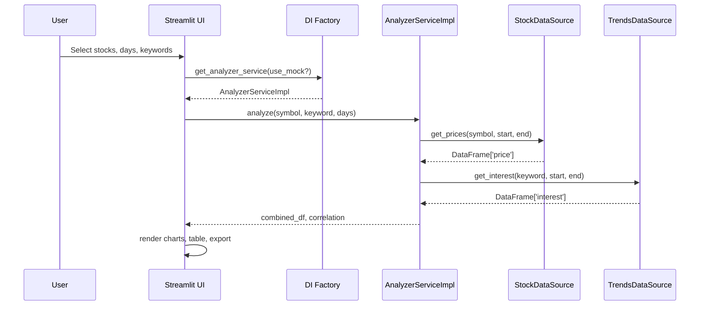

# Stock vs Trends Analyzer — Design Document

Version: 0.1
Date: 2025-11-01
Authors: Pranab

## 1. Overview

- Purpose: Analyze relationships between stock prices and public search interest to support exploratory investment insights.
- Users: Students, analysts, hobbyists.
- Scope: Interactive charts, correlation summary, CSV export. Mock mode for demos; real mode via APIs.

## 2. Use Case and Data Sources

- **Primary Use Case**
  - Users select one or more stock symbols and a time window.
  - App fetches stock prices and search interest time series.
  - App computes and visualizes correlations and trends.

- **Data Sources**
  - **Stock Prices**: Alpha Vantage (Time Series Daily)
    - Endpoint: `function=TIME_SERIES_DAILY`
    - Access: API Key required (free tier).
    - Rate limit: 5 calls/minute (free); batching and caching recommended.
  - **Search Trends**: Google Trends via PyTrends
    - Access: No key; subject to Google throttling and network conditions.
    - Data is normalized (0–100) over selected timeframe.

- **Mock Mode**
  - Deterministic generators for price and trend series (repeatable; weekend and periodic patterns).
  - Used as fallback or for development.

- **API Feasibility Checks (completed)**
  - Alpha Vantage reachable with provided key; response JSON parsed into daily close prices.
  - PyTrends can build payloads and fetch interest over time across custom timeframes.
  - App gracefully falls back to mocks if key or PyTrends unavailable.

## 3. Planned Technologies

- **Language**: Python 3.12
- **Frontend/UI**: Streamlit
- **Charts**: Plotly
- **Dataframes**: Pandas, NumPy
- **HTTP**: requests
- **Trends**: pytrends
- **Config**: python-dotenv (.env)
- **Architecture**: Ports & Adapters (Clean Architecture)
- **Optional Backend**: FastAPI (future extension)
- **Persistence (future)**: SQLite + SQLAlchemy (for caching), or Redis

## 4. Architecture and Components

- Guiding Pattern: Clean Architecture (Ports/Adapters) with a modular Streamlit frontend.
- Separation of concerns:
  - UI (view/controller) isolated from business logic (services).
  - Services depend on interfaces (ports), not on concrete API clients.
  - Infrastructure adapters implement interfaces for specific providers (Alpha Vantage, PyTrends, Mocks).

### 4.1 Project Structure

- app/
  - domain/ (future domain models)
  - ports/
    - `stock_data_source.py`
    - `trends_data_source.py`
    - `analyzer_service.py`
  - services/
    - `analyzer_service_impl.py`
  - infrastructure/
    - `alpha_vantage_client.py` (StockDataSource)
    - `pytrends_client.py` (TrendsDataSource)
    - `mock_sources.py` (both interfaces)
  - config/
    - `di.py` (dependency factory)
  - ui/
    - `charts.py` (pure charting)
- `streamlit_app.py` (UI entry)
- `.env`, `requirements.txt`, `.gitignore`

### 4.2 Key Interfaces (Ports)

- **StockDataSource**
  - `get_prices(symbol, start, end) -> pd.DataFrame['price']`
- **TrendsDataSource**
  - `get_interest(keyword, start, end) -> pd.DataFrame['interest']`
- **AnalyzerService**
  - `analyze(symbol, keyword, days) -> (combined_df, correlation)`

### 4.3 Services

- **AnalyzerServiceImpl**
  - Orchestrates data fetching from both sources.
  - Fuses timeseries (forward fill), drops NA, computes Pearson correlation.

### 4.4 Infrastructure Adapters

- **AlphaVantageClient**
  - Fetches daily close prices, converts to `['price']`, date-indexed.
- **PyTrendsClient**
  - Fetches interest over time, converts to `['interest']`, date-indexed.
- **MockStockSource / MockTrendsSource**
  - Generates realistic mock sequences (seasonality, noise, spikes).

### 4.5 UI

- **Streamlit**
  - Inputs: stock selection, days slider, mock toggle, API key, custom keywords.
  - Outputs: correlation table, dual-axis plotly charts, CSV export.

### 4.6 Dependency Injection

- `get_analyzer_service(use_mock=None)`
  - If mock requested → mock providers.
  - Else validate `ALPHAVANTAGE_API_KEY` and PyTrends availability; if missing, fall back to mocks.
  - Toggle in UI and `.env` control behavior.

## 5. Component and Interaction Diagrams

### 5.1 Component Diagram (Mermaid)

```mermaid
flowchart LR
  subgraph UI[Streamlit UI]
    A[streamlit_app.py]
    C[charts.py]
  end

  subgraph Services
    S[AnalyzerServiceImpl]
  end

  subgraph Ports[Ports (Interfaces)]
    P1[StockDataSource]
    P2[TrendsDataSource]
  end

  subgraph Infra[Infrastructure Adapters]
    AV[AlphaVantageClient]
    PT[PyTrendsClient]
    MK[Mock Sources]
  end

  subgraph Config[DI]
    DI[get_analyzer_service()]
  end

  A -->|calls| DI
  DI -->|wires| S
  S -->|depends on| P1
  S -->|depends on| P2
  P1 --> AV
  P2 --> PT
  P1 --> MK
  P2 --> MK
  A -->|plots with| C
```

### 5.2 Sequence (Single Analysis)



## 6. Non-Functional Requirements

- **Usability**: Simple controls, clear labeling, responsive charts.
- **Reliability**: Fallback to mock providers on failure; error messages in UI.
- **Performance**: Cache (future), minimal overfetching, compact data merges.
- **Security**: Keys in `.env`, not committed; no keys in code.
- **Portability**: Streamlit app runnable locally; future: containerization.
- **Testability**: Services testable via mock providers; adapters testable with live/sandbox APIs.

## 7. Risks and Mitigations

- **API Rate Limits (Alpha Vantage)**  
  - Mitigation: Caching results (requests-cache/SQLite), batch UX (limit concurrent).
- **PyTrends Throttling**  
  - Mitigation: Respectful request pacing; fallback to mock.
- **Schema/API Changes**  
  - Mitigation: Keep adapters thin; unit tests on parsing.
- **Data Quality Variability**  
  - Mitigation: FFill + NA drop; cap interest ranges; validation hooks.

## 8. Testing Strategy

- **Unit Tests**
  - `AnalyzerServiceImpl` with mock sources (deterministic inputs).
- **Integration Tests**
  - Alpha Vantage: fetch known symbol for small date windows.
  - PyTrends: fetch interest for known term and timeframe.
- **UI Smoke Tests**
  - Run with mocks; verify chart renders and CSV export.

## 9. Roadmap

- **Phase 1 (Done)**
  - Clean architecture skeleton; mock + real adapters; Streamlit UI.
- **Phase 2**
  - Add repository interfaces and local caching (SQLite/SQLAlchemy).
  - Add request caching (requests-cache) and retry/backoff.
- **Phase 3**
  - Optional FastAPI backend; Streamlit becomes a thin client.
  - AuthN/AuthZ, user preferences persistence.
- **Phase 4**
  - Additional analyses (lagged correlation, rolling windows, Granger causality).
  - Alerts and scheduled fetches.

## 10. Configuration

- `.env`
  - `USE_MOCK=false`
  - `ALPHAVANTAGE_API_KEY=…`
- UI sidebar
  - Toggle mock mode; override API key at runtime.

## 11. Open Questions

- Do we need persistence now (cache/store results)?
- How large are typical analysis batches (N stocks)? Controls for rate limit?
- Any privacy constraints or audit logs needed?

## 12. Appendix: File Map

- `app/ports/*`: Interfaces decoupling services from providers.
- `app/infrastructure/*`: Concrete providers (Alpha Vantage, PyTrends, Mock).
- `app/services/analyzer_service_impl.py`: Core analysis logic.
- `app/config/di.py`: Provider wiring/fallbacks.
- `app/ui/charts.py`: Pure chart creation functions.
- `streamlit_app.py`: UI/controller.
